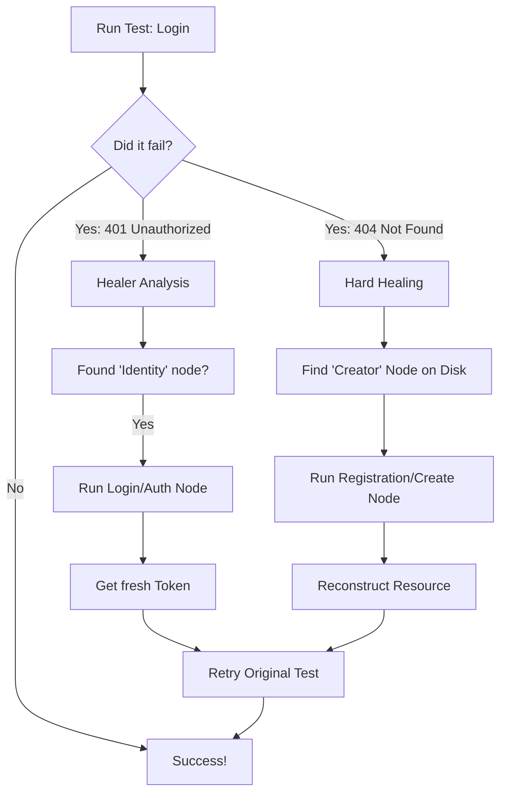

# The Rumour Healer: Make Your Tests Unstoppable

Imagine you're running a test and the server says **"401 Unauthorized"** or **"404 Not Found"**. Usually, your test would just die.

**Rumour is different.** When it hits a wall, it stops, thinks, fixes the problem (like logging in or registering a user), and then tries again. This is **Healing**.

## Quick Start: The "Magic" in 3 Steps

To see the magic happen, you just need to do three things:

1.  **Use Variables**: Don't hardcode emails or IDs. Use `{{user_email}}`.
2.  **Tell Rumour who "Owns" the variable**: Use a `[[dependencies]]` block.
3.  **Run with the flags**: Use `-HX` (Heal + Hard Heal).

```bash
# The magic command
rumour run my_test.toml -HX
```

## 🗺️ How it Works (The Visual Flow)



## The "Self-Healing" Recipe

If you want a test to be able to fix itself, follow this simple recipe:

### 1. The "Creator" (e.g., `0_register.toml`)

This node must **extract** what it creates.

```toml
[request]
url = "{{base_url}}/register"

[extract]
# This "publishes" the email so others can use it
healed_email = "user.email"
```

### 2. The "Consumer" (e.g., `1_login.toml`)

This node must **declare** its dependency.

```toml
[request]
url = "{{base_url}}/auth/login"

[body]
raw = '{"email": "{{healed_email}}"}'

[[dependencies]]
# "If healed_email is missing, run 0_register.toml"
consumer_var = "healed_email"
producer_id = "0_register.toml"
```

## Zero-Config: The "Mind Reader" Discovery

What if you **don't** add the `[[dependencies]]` block? Rumour is still smart enough to fix your test.

When a test fails with a 404 (Missing) or 401 (Auth), Rumour starts a **Filesystem Scan** to find a "Creator" node automatically.

### How Rumour "Guesses" the right fix:

1.  **Filename Match**: It looks for files in your folder that contain keywords like `register`, `signup`, `create`, `post`, or `add`.
2.  **Variable Match**: It looks for files that have a `produces` list containing the variable you need (e.g. if `user_id` is missing, it finds the file that produces `user_id`).
3.  **The "Resource Hint"**: If you get a 401 on `/auth/login`, it specifically looks for nodes with "login" or "auth" in the URL or filename.

### Which should you use?

| Feature      | Zero-Config (No Block)               | Explicit Dependency (`[[dependencies]]`) |
| :----------- | :----------------------------------- | :--------------------------------------- |
| **Effort**   | 0 effort. Just name your files well. | Requires a small TOML block.             |
| **Accuracy** | 90% (Good for simple folders).       | 100% (Guaranteed to run the right file). |
| **Speed**    | Slightly slower (scans disk).        | Instant (already in the graph).          |
| **Best For** | Quick tests & discovery.             | Complex pipelines & production suites.   |

> [!TIP]
> **The Golden Rule of Naming**: If you use Zero-Config, name your files descriptively!
> ✅ `0_register_user.toml` -> Rumour loves this.
> ❌ `test_case_1.toml` -> Rumour has no idea what this does.

## What are the Healing Levels?

| Level                  | What happened?                                     | How Rumour fixes it                                                            |
| :--------------------- | :------------------------------------------------- | :----------------------------------------------------------------------------- |
| **Identity Bootstrap** | Token expired or missing.                          | It finds your login node, logs in, and gets a new token.                       |
| **Smart Mutation**     | You sent a `null` field the server hates.          | It removes the `null` and tries again automatically.                           |
| **Hard Healing**       | You're trying to login but the user doesn't exist. | It scans your files, finds your "Register" node, and creates the user for you. |

## When will it NOT work?

If you don't follow these 3 rules, the healer will give up:

1.  **The "Ghost" Rule**: If you don't use `[[dependencies]]` AND your filename doesn't include words like `register` or `create`, Rumour won't know how to fix a 404.
2.  **The "Empty Hands" Rule**: If your registration node runs but **doesn't extract** the ID or Email, the healer has nothing to give to the failing test.
3.  **The "Loop" Rule**: If A depends on B, and B depends on A, Rumour will stop to prevent an infinite loop.

## What you'll see in your Terminal

When Rumour heals a test, it looks like this:

```text
  ✗ FAILED: 1_login.toml (HTTP 401)
  ⚡ Hard Healing: Executing creator node 0_register.toml...
  ✓ SUCCESS: 0_register.toml
  ✔ Satisfying dependency: healed_email
  ↻ Retrying original request: 1_login.toml
  🔨 1_login.toml → RECONSTRUCTED (Hard Heal)
```

### Pro Tip

Always keep your files in the same folder. Rumour is smart—it scans the local folder first to find "Creators" even if you forgot to add them to your workspace!
